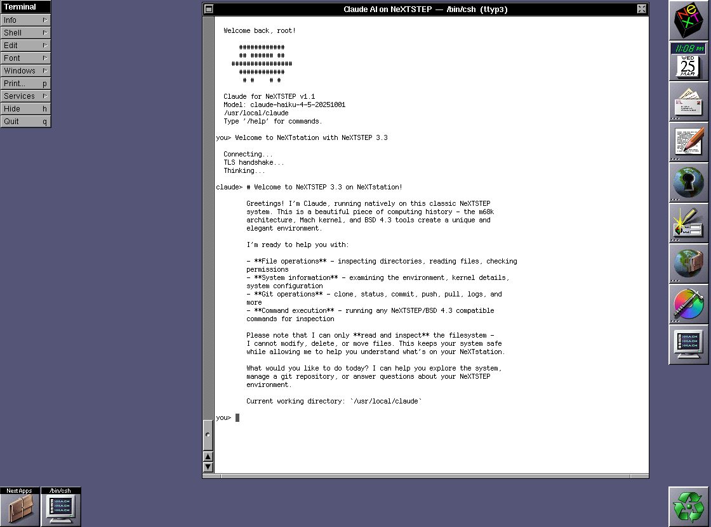

# Claude for NeXTSTEP

A native Claude AI console client for NeXTSTEP 3.3, running on a NeXTstation Turbo Color (68040 @ 33MHz).

This project brings modern AI to vintage hardware — a C client that speaks directly to the Claude API over TLS 1.2, compiled with gcc 2.5.8 from 1993.



## Hardware

- **NeXTstation Turbo Color** — Motorola 68040 @ 33MHz, running NeXTSTEP 3.3


## How It Works

The NeXTstation connects directly to the Claude API (`api.anthropic.com`) over HTTPS using [Crypto Ancienne](https://github.com/classilla/cryanc), a TLS library designed for vintage systems. No proxy or middleware needed — the 68040 handles TLS 1.2 natively.

```
NeXTstation (68040)  ──── HTTPS/TLS 1.2 ────►  api.anthropic.com
     192.168.1.2                                     Claude API

```

TLS handshake takes ~10 seconds on the 33MHz 68040. A small price for direct, encrypted communication from a 1993 machine.

## Building

On the NeXTstation:

```sh
cc -O -c cryanc.c -o cryanc.o    # one-time, reuse .o
cc -O -c claude.c -o claude.o
cc -o claude claude.o cryanc.o -lsys_s
```

## Usage

```sh
./claude                                    # default mode, prompts for command approval
./claude --dangerously-skip-permissions     # auto-execute commands (deny list still enforced)
./claude -y                                 # short form of above
./claude sk-ant-...                         # pass API key directly
```

Requires a Claude API key in `~/.claude_api_key` or pass at startup.

## Features

### Command Execution (v1.1)

Claude can execute shell commands on the NeXTstation to answer questions about your system. When you ask "what files are in this directory?", Claude will run `ls` and respond with the real output.

**Safety system (three-tier, evaluated in order):**

1. **Deny** — Always blocked, even with `-y`. Hardcoded: `rm`, `mv`, `cp`, `dd`, `mkfs`, `newfs`, `fdisk`, `format`, `chmod`, `chown`, `mknod`, `halt`, `reboot`, `shutdown`. Custom: `.claude_deny`
2. **Allow** — Auto-approved without prompting. Custom: `.claude_allow`
3. **Ask** — Prompts user for y/n approval (skipped with `-y`)

Commands are restricted to the working directory. Path traversal (`..`) and absolute paths outside cwd are blocked.

### Platform Detection

At startup, Claude auto-detects the NeXTSTEP environment via `hostinfo`, `hostname`, and `arch`. This context is included in every request so Claude uses BSD 4.3 compatible commands.

### Commands

| Command | Description |
|---------|-------------|
| `/model` | List & select model |
| `/model <name>` | Switch to model |
| `/system <text>` | Set custom system prompt |
| `/temp <0-1>` | Set temperature |
| `/tokens` | Show last token usage |
| `/save <file>` | Save conversation to file |
| `/new` | Start new conversation |
| `/clear` | Clear conversation |
| `/info` | Show session info |
| `/key` | Reload API key |
| `/version` | Show version |
| `/exit` | Exit |

### Configuration Files

| File | Purpose |
|------|---------|
| `.claude_api_key` | Anthropic API key |
| `.claude_model` | Last-used model (auto-saved) |
| `.claude_models` | Available models list (one per line) |
| `.claude_deny` | Blocked command prefixes (one per line) |
| `.claude_allow` | Pre-approved command prefixes (one per line) |
| `claude.log` | Session log (auto-created in working directory) |

## Project Structure

```
claude.c          — Main client source
cryanc.c          — Crypto Ancienne TLS library (vendored)
cryanc.h          — Crypto Ancienne header (vendored)
```

## Credits & Acknowledgments

### Authors
- **ARNLTony** — Project creator, hardware setup, integration
- **Claude (Anthropic)** — AI pair programmer, client code, architecture

### Key Dependencies
- **[Crypto Ancienne (cryanc)](https://github.com/classilla/cryanc)** by Cameron Kaiser — TLS 1.2/1.3 library for vintage systems. This project would not be possible without it. Crypto Ancienne is specifically designed for pre-C99 compilers and old hardware, with explicit support for NeXTSTEP 3.3 on 68K.
- **[Claude API](https://docs.anthropic.com/en/docs/api)** by Anthropic — The AI backend

### Tools & Infrastructure
- **[Claude Code](https://claude.ai/claude-code)** — Anthropic's CLI tool, used for all development
- **NeXTSTEP 3.3** (NeXT Computer, 1993) — The operating system
- **gcc 2.5.8** (cc-437.2.6) — The compiler, vintage 1993

### Inspiration
- The NeXT community at [nextcomputers.org](https://www.nextcomputers.org/)
- Cameron Kaiser's work on [retrocomputing internet access](http://oldvcr.blogspot.com/2020/11/fun-with-crypto-ancienne-tls-for.html)
- The broader vintage computing community pushing old hardware to do new things

## License

MIT License. See [LICENSE](LICENSE) for details.

Crypto Ancienne is licensed under its own terms — see [cryanc repo](https://github.com/classilla/cryanc) for details.
